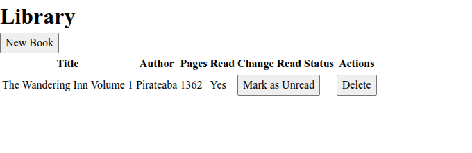
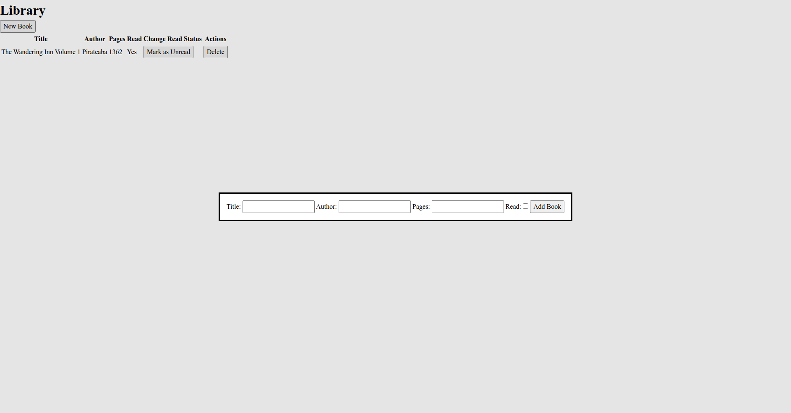

# Book Library

Branch **main** created for **[Project Odin](https://www.theodinproject.com/lessons/node-path-javascript-library)**

Branch **with-classes** created for **[Project Odin](https://www.theodinproject.com/lessons/node-path-javascript-classes#practice)**

Branch **form-validation** created for **[Project Odin](https://www.theodinproject.com/lessons/node-path-javascript-form-validation-with-javascript#warmup)**

## Features 

Vanilla **JS** library. The repository branches demonstrate different programming concepts: object constructors, classes, and client-side form validation.

You can create a new book using the button. It will be inserted into your library. You may delete your books or change their read status.

## Live Preview 

Current branch of github pages: **form-validation**

To see this website live click this [Link](https://devoid-of-thought.github.io/odin-library/)